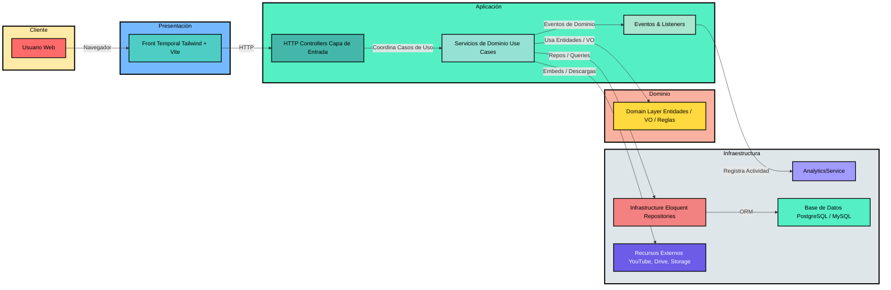

<h1 align="center">Biblioteca CDT – Catálogo Inteligente de Modelos IA/IoT</h1>

Aplicación Laravel 12 que centraliza modelos, kits y recursos digitales del Centro de Desarrollo Tecnológico de Territorios Inteligentes de la UNAB. La interfaz web incluida es **provisional** y solo expone lo suficiente para validar el backend (catálogo, filtros, autenticación y analíticas); el proyecto está pensado para integrarse con un front definitivo (web, móvil o kioscos) mediante las capas de servicios existentes.

## Tabla de contenido

1. [Arquitectura general](#arquitectura-general)
2. [Estructura de carpetas](#estructura-de-carpetas)
3. [Módulos y funcionalidades](#módulos-y-funcionalidades)
4. [Modelo de datos y relaciones](#modelo-de-datos-y-relaciones)
5. [Principios SOLID, POO y tratamiento de problemas](#principios-solid-poo-y-tratamiento-de-problemas)
6. [Escalabilidad y buenas prácticas operativas](#escalabilidad-y-buenas-prácticas-operativas)
7. [Manual de usuario](#manual-de-usuario)
8. [Configuración y ejecución](#configuración-y-ejecución)
9. [Pruebas automatizadas](#pruebas-automatizadas)
10. [Roadmap sugerido](#roadmap-sugerido)

## Arquitectura general

El backend está organizado en capas explícitas (Domain, Services, Infrastructure, HTTP) siguiendo principios de arquitectura limpia. El flujo completo puede verse en el siguiente diagrama:



Puntos clave:

- **Dominio fuerte**: DTOs y Value Objects encapsulan TRL, slugs, colores y opciones de disponibilidad; evita fugas de tipos primitivos.
- **Servicios orquestadores** (ModelSearchService, ModelDetailService, ResourceEmbedService, GamificationService) concentran el negocio y facilitan futuros canales (API REST, GraphQL, CLI).
- **Infraestructura desacoplada** mediante interfaces (`ModelSearchRepositoryInterface` y estrategias de filtros) que permiten reemplazar Eloquent por otro motor (Elastic, Meilisearch) sin tocar la lógica superior.
- **Eventos y analíticas** para rastrear vistas de modelos/recursos y alimentar paneles futuros sin bloquear al usuario.

## Estructura de carpetas

```
app/
  Domain/               # DTOs, Value Objects y modelos puros
  Events/Listeners/     # Telemetría y métricas
  Http/Controllers/     # Capas de entrada (Home, Catálogo, Recursos, Auth)
  Infrastructure/
    Eloquent/Models/    # Representaciones persistentes
    Repositories/       # Repositorios concretos
  Services/             # Casos de uso, filtros, embeds, seguridad
config/                 # Configuración Laravel y terceros
database/migrations/    # Tablas, pivotes y métricas
public/                 # Front provisional y assets
resources/              # Vistas Blade, componentes y Tailwind
routes/web.php          # Rutas públicas/autenticación
tests/                  # Suite feature + arquitectura
```

## Módulos y funcionalidades

### HTTP (UI provisional)

- `HomeController` pinta carrusel, sectores destacados, filtros preconfigurados y narrativa del CDT.
- `CatalogController` expone el buscador: filtros por sector, TRL, datasets, tecnología, tags, prospectiva (IA/IoT) y availability flags. Aplica paginación, resaltado y orden dinámico.
- `ModelDetailController` valida permisos, dispara eventos `ModelViewedEvent`, proyecta DTOs detallados y aplica gamificación/badges.
- `ResourceController` asegura políticas (`AuthorizationService`), redirige a URLs o archivos internos y genera `ResourceViewedEvent`.
- `AuthController` provee login básico con sesiones y roles/permissions de Spatie.

> Recordatorio: el front Blade/Tailwind (`resources/views`) sirve solo como prototipo visual; la intención es reemplazarlo por un frontend especializado que consuma estas rutas/servicios o una API pública.

### Dominio

- **DTOs** (`ModelCardDTO`, `ModelDetailDTO`, `FilterStateDTO`, `ResourceEmbedDTO`) transportan datos tipados entre capas.
- **Value Objects** (`TRLLevel`, `ColorCode`, `Slug`, `AvailabilityOption`) encapsulan reglas.
- **Interfaces** (`ModelSearchRepositoryInterface`, `FilterStrategyInterface`) permiten múltiples motores de búsqueda y pipelines de filtros.

### Servicios

- `ModelSearchService` construye el estado de filtros (con sanitización fuerte) y ejecuta queries paginadas sobre el repositorio definido.
- `FilterOrchestrator` recorre estrategias (sector, tags, dataset, availability, TRL range, texto completo, prospectiva) aplicadas solo si el filtro está activo.
- `ModelDetailService` arma fichas completas con recursos embebibles y estado restringido.
- `ResourceEmbedService` usa estrategias (`EmbedStrategies`) para Youtube, PDF, enlaces, etc. Si el recurso necesita autenticación, `RestrictedResourceDecorator` difumina contenido hasta que haya permisos.
- `ModelHighlightService` cachea destacados y más vistos (CacheRepository) para alivianar consultas.
- `GamificationService` guarda sectores explorados en Cache (por usuario) y entrega insignias contextuales.
- `AuthorizationService` centraliza roles (`cdt-admin`, `visitor`) y permisos (`catalog.view_restricted`, `catalog.manage`), aplicando POO y reglas únicas.
- `AnalyticsService` registra vistas (modelos/recursos) y mantiene métricas (`model_metrics`, `model_views`, `resource_views`).

### Infraestructura y datos

- Modelos Eloquent para sectores, modelos, tags, tecnologías, datasets, recursos, métricas y vistas.
- Repositorios concretos (`EloquentModelRepository`, `EloquentSectorRepository`) resuelven queries y adaptan colecciones a DTOs.
- Migraciones cubren tablas principales, pivotes y permisos Spatie.

### Eventos y listeners

- `ModelViewedEvent` y `ResourceViewedEvent` disparan `RegisterModelView/RegisterResourceView` para registrar analíticas asincrónicamente; permite extender con listeners adicionales (notificaciones, scoring, etc.).

## Modelo de datos y relaciones

Relaciones principales:

- `models` pertenece a un `sector`, tiene muchos `resources` (pivot `model_resource` con `visibility` y `display_order`), muchos `tags`, `technology_types`, `dataset_types`.
- `resources` pueden requerir autenticación y guardan proveedor/URL/archivo.
- `model_metrics`, `model_views` y `resource_views` almacenan estadísticas.

```medusa
graph TD
    Sector <--1:N--> Model
    Model <--M:M--> Tag
    Model <--M:M--> TechnologyType
    Model <--M:M--> DatasetType
    Model <--M:M--> Resource
    Model --> Metric
    Model --> ModelView
    Resource --> ResourceView
```

## Principios SOLID, POO y tratamiento de problemas

- **Single Responsibility**: cada servicio hace una cosa (buscar, destacar, detallar, autorizar). Controladores solo coordinan la vista.
- **Open/Closed**: estrategias de filtros y de embeds permiten agregar nuevos criterios/proveedores sin modificar implementaciones existentes.
- **Liskov**: las interfaces (`ModelSearchRepositoryInterface`, `FilterStrategyInterface`, `ResourceEmbedStrategyInterface`) garantizan contratos claros para nuevos adaptadores.
- **Interface Segregation**: se usan interfaces específicas en vez de repositorios monolíticos.
- **Dependency Inversion**: los servicios consumen interfaces y `iterable` de estrategias, lo que facilita inyección vía Service Container de Laravel.
- **POO aplicada a errores comunes**:
  - Validación de filtros con VO evita TRLs inválidos.
  - Decoradores para recursos restringidos encapsulan lógica de "blur" sin tocar el DTO original.
  - DTOs permiten serializar/exportar fácilmente hacia APIs o colas.

## Escalabilidad y buenas prácticas operativas

- **Cache**: ModelHighlightService y GamificationService usan CacheRepository; se puede configurar Redis/Memcached para despliegues mayores.
- **Búsqueda avanzada**: gracias a `ModelSearchRepositoryInterface`, se pueden alternar implementaciones (Elastic, Algolia) para catálogos más grandes.
- **Analíticas asíncronas**: los eventos ya desacoplan la escritura de métricas. Activar colas (`php artisan queue:work`) elimina bloqueo en picos.
- **Sharding/Multitenant**: IDs y slugs consistentes permiten extender `FilterStateDTO` con `tenant_id` sin romper la API.
- **Seguridad**: Spatie Permission y `AuthorizationService` centralizan control de acceso. Recursos privados redirigen a login y nunca exponen URLs si no hay permisos.
- **Observabilidad**: `ModelViewedEvent`/`ResourceViewedEvent` guardan metadata (IP, session, source). Puede conectarse a un Data Lake o BI.
- **Tratamiento de problemas comunes**:
  - *Datos inconsistentes*: Value Objects validan inputs; se recomienda colas para sincronización externa.
  - *Sobrecarga de filtros*: pipeline de estrategias evita queries gigantes y permite paginar en DB.
  - *Integración de recursos externos*: `ResourceEmbedService` es extensible para nuevos proveedores (Drive, Vimeo, enlaces internos).

## Manual de usuario

1. **Acceso**  
   - Visita `/login`, ingresa correo y contraseña configurados en la base. Los roles `cdt-admin` o `visitor` desbloquean recursos restringidos.
2. **Explorar portada**  
   - Desde `/` navega el carrusel de modelos destacados, consulta objetivos del CDT y filtra por sectores/tecnologías desde el panel lateral.
3. **Buscar en el catálogo**  
   - En `/catalog` usa filtros combinados: sector, TRL, tags, tecnologías, datasets, disponibilidad (demo, video, API) o modo prospectivo (IA, IoT). El listado se paginá automáticamente.
4. **Consultar un modelo**  
   - Selecciona una tarjeta para ver la ficha completa: descripción larga pública/privada, TRL, insignias, recursos relacionados y alertas de autenticación.
5. **Abrir recursos**  
   - Pulsa “Abrir” para ser redirigido al proveedor (YouTube, PDF, API). Si requiere autenticación, el sistema solicita sesión antes de permitir el acceso.
6. **Cerrar sesión**  
   - Usa el botón en el header para cerrar y limpiar la sesión.

> Nota: el sistema otorga insignias temporales según sectores explorados; se muestran en la vista de detalle cuando el usuario está autenticado.

## Configuración y ejecución

1. **Dependencias**  
   - PHP 8.2+, Composer, Node 20+, base de datos MySQL/PostgreSQL, Redis opcional para cache/colas.
2. **Instalación**
   ```bash
   composer install
   cp .env.example .env
   php artisan key:generate
   # Configura DB, cache y cola en .env
   php artisan migrate
   npm install
   npm run build # o npm run dev para Vite
   ```
3. **Entorno local**
   ```bash
   php artisan serve
   npm run dev        # recompila Tailwind 4 con Vite
   php artisan queue:work --tries=1   # recomendado para eventos
   ```
4. **Seeding/roles**  
   - Usa Spatie Permission para crear roles `cdt-admin` o `visitor` y asignar permisos `catalog.view_restricted`, `catalog.manage`.

## Pruebas automatizadas

- Ejecuta `php artisan test` o el script `composer test`.  
- `tests/Feature/ArchitecturePhasesTest.php` recorre cuatro fases:
  1. **Dominio**: valida Value Objects/DTOs y migraciones.
  2. **Infraestructura/Auth**: asegura binding del repositorio y roles/permisos.
  3. **Filtros**: inspecciona la SQL generada por el pipeline de estrategias.
  4. **Servicios/Eventos**: prueba `ResourceEmbedService` y registro de vistas vía eventos.

Amplía la suite agregando pruebas para nuevos filtros, servicios y controladores antes de desplegar.

## Roadmap sugerido

1. **Front definitivo**: consumo vía API o componentes Livewire/SPA; internacionalización y accesibilidad.
2. **API pública**: exponer `ModelCardDTO`/`ModelDetailDTO` como endpoints versionados.
3. **Panel administrativo**: CRUD de modelos, recursos y métricas con políticas basadas en `AuthorizationService`.
4. **Buscador avanzado**: integrar motor full-text externo y cachear agregaciones.
5. **Alertas y suscripciones**: listeners adicionales sobre `ModelViewedEvent` para notificar sectores u obtener retroalimentación.
6. **Integración BI**: exportar `model_views` y `resource_views` a lago de datos para dashboards regionales.
